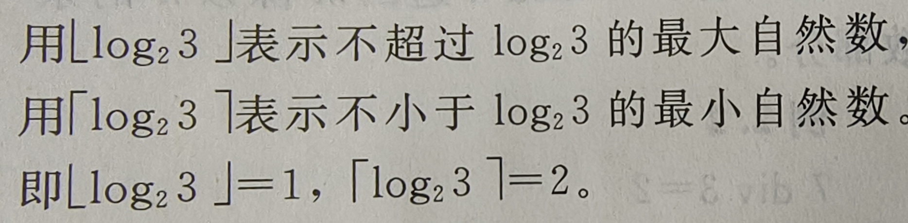
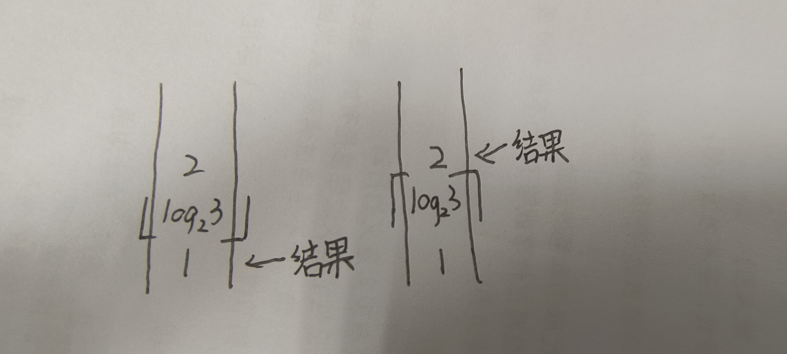
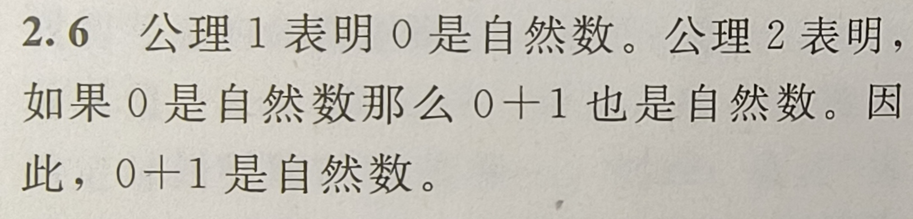

1. 自然数
   - 从0开始的非负整数
   - 一些运算
     - div    ===    /
     - mod    ===    %
     - ∑ 求和
       - 当上面的数小于下面的数时，结果为0
       - 相当于for循环
     - Π 求积
       - 于求和近似
     - 
       - 你可以理解成一条柱子，上面刻了很多数字
       - 
2. Peano算术
   - 一组刻画自然数基本性质的规则
   - 
   - 使用Peano算术的公理，证明0+1是自然数
   - 