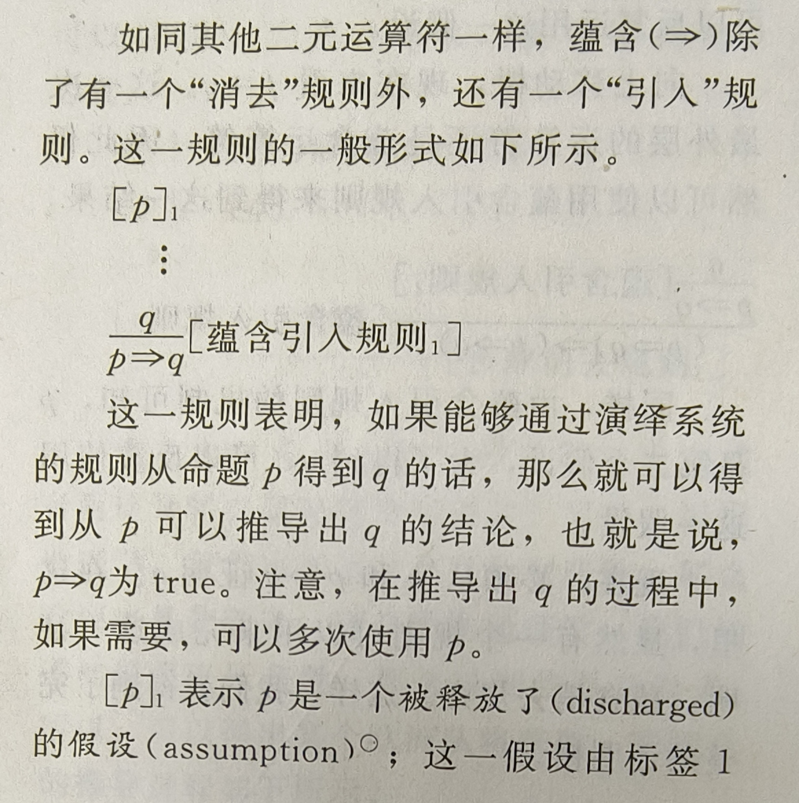

1. 原子命题
   - 命题
     - 陈述为真或假
   - 原子命题
     - 
     - 原子命题，指不能再分解为更简单的陈述句的命题。
2. 真值
   - true false
   - 未定义（不会用到）
3. 否定运算符
   - ¬p    === 对p命题取反
   - (¬¬p) <=> p
4. 合取运算符
   - ∧   === AND
   - (p∧q) <=> (q∧p)
   - p∧(q∧r) <=> (p∧q)∧r
5. 析取运算符
   - ∨   === OR
   - 德·摩根律
     - 
   - p∨q <=> q∨p
   - 分配律
     - 
     - 
     - 可以注意到，分配律与括号的位置有关
6. 蕴含运算符
   - p => q 读作“p蕴含q”或者“如果p，则q”
   - 对于任意的命题p和q，有
     - (p => q) <=> ((¬p)∨q)
7. 等值运算符
   - p <=> q
   - 提示：在前面的定义中已经用了大量的等值运算符
8. 运算的优先级
   - 
   - 
   - 
9.  重言式、矛盾式和不定式
   - 重言式
     - 
   - 矛盾式
     - 类似于重言式，就是总为false的命题
   - 不定式
     - 既不是重言式也不是矛盾式
10. 真值表
   - 
   - 
11. 等值推理
   - 
   - 
   - 
   - 后面用证明树可以可视化证明
12. 自然演绎(证明树)
   - 
   - 
   - 
   - 注：被释放了的假设指的是某个子演绎的假设，但对整个演绎不再是假设
   - 
   - 
   - 
   - 
   - 