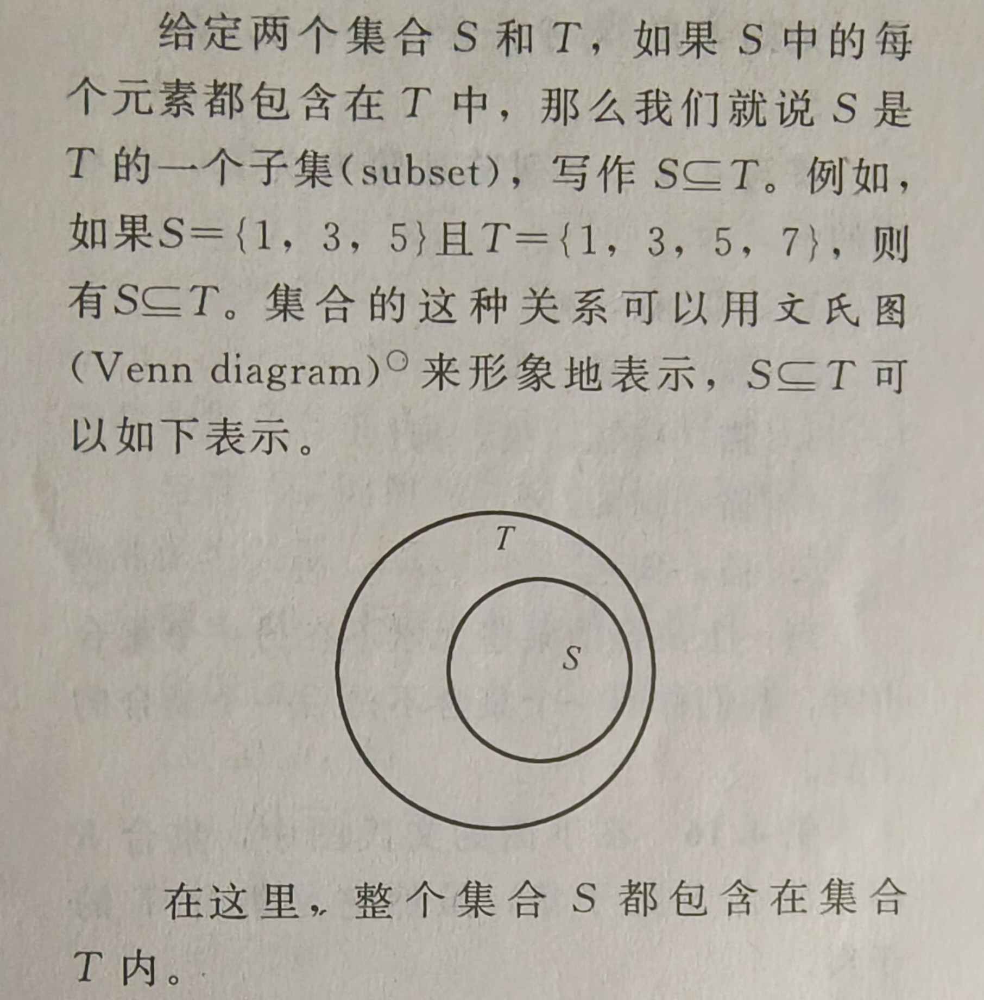
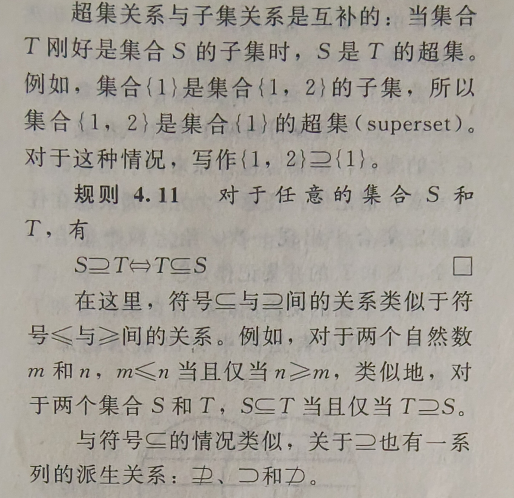
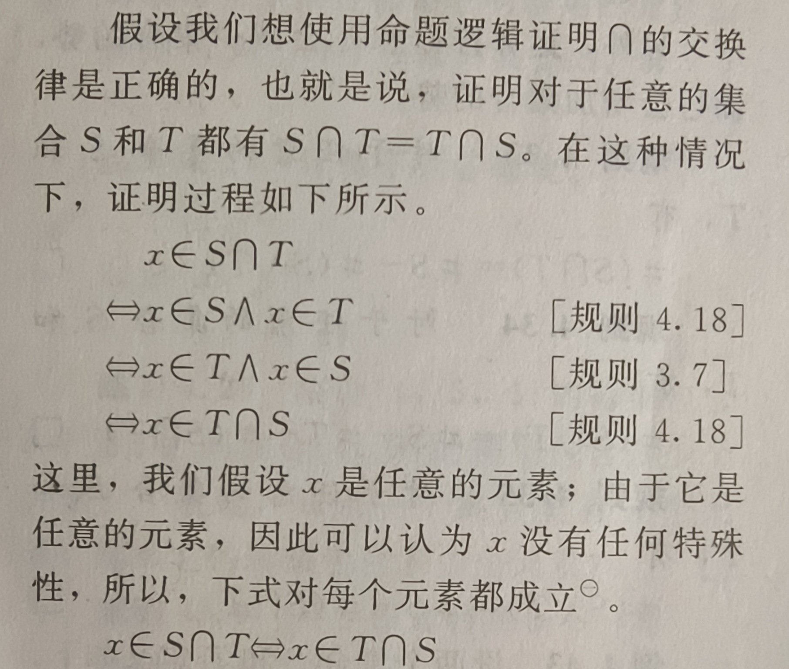
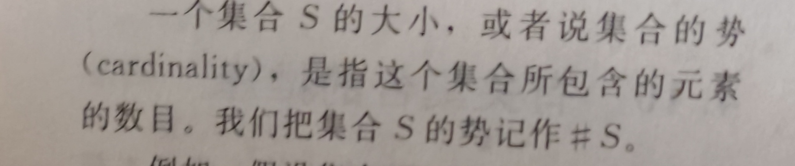
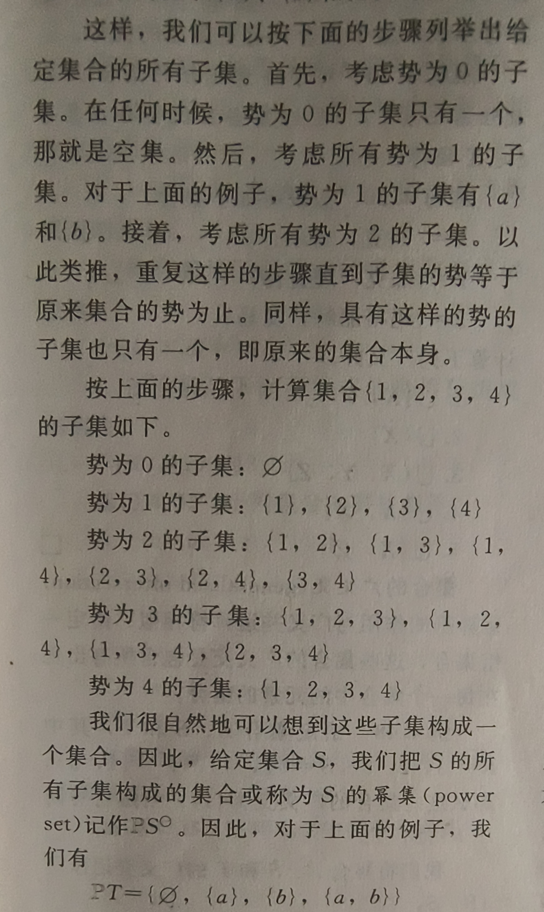

1. 集合
   -  外延法或枚举法
   -  即直接把元素列出来
2. 单集
   1. 只包含一个元素的集合
3. 空集
   1. 不包含任何元素的集合
4. 集合成员
   1. 集合中的元素
5. 子集
   1. 
6. 超集
   1. 
7. 集合的并集
   1. 不多赘述
8. 集合的交集
   1. 不多赘述
9.  集合的差集
    1.  S\T
10. 有关集合的推理
    1.  
11. 集合的势
    1.  
12. 有穷集合和无穷集合
    1.  不多赘述
13. 集合的幂集
    1.  
14. 集合的广义运算
    1.  广义并和广义交，换了一种表现形式而已，无需了解12