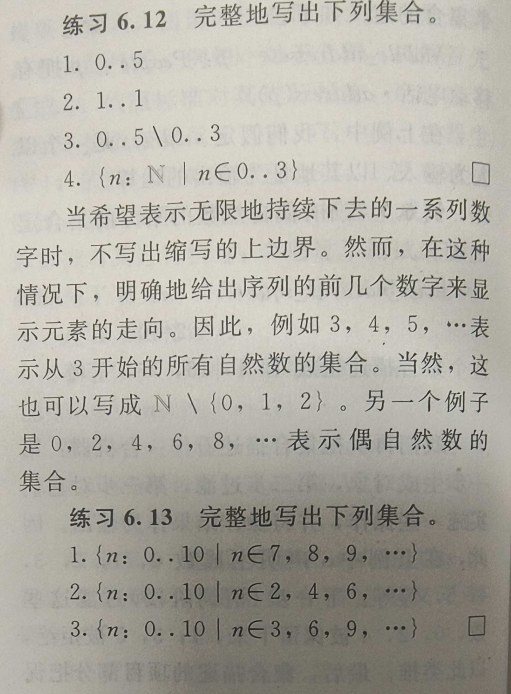

1. 类型的需要
   1. 避免使用不同集合类型进行运算
   2. 比如一个集合是水果，一个集合是数字，这时候就不要一起运算了
   3. 类型的一个悖论
      1. 定义一个集合装有任何集合
      2. 但是PS是S的子集，却集合的势更大，所以是一个不可能存在的情况
      3. 
   4. 公理集合论
      1. 
2. 再论空集
   1. 通过公理集合论， 我们可以知道，空集有可能是不同的，也就是说一个在水果上的空集，和一个在数字上的空集不等价
   2. 因此，空集的种类是无限多的
3. 集合描述
   1. 
   2. 也就是说，前面是大范围限定，后面是小范围限定。前面是领域限定，后面是具体条件限定
   3. 
   4. 注意这里的·不是一种运算，而是一种书写格式的表达
   5. 就是把满足条件的元素再加一种运算表达出来
4. 特征组
   1. 现在遇见的特征组都是简单的
5. 缩写
   1. ..运算符，不知道是什么阶段学的，反正很自然就能写出来
   2. 
6. 笛卡尔积
   1. 这一章会涉及到复杂集合，建议细读
   2. 
   3. 
   4. 注意：笛卡尔积的势是两个集合的势相乘
   5. 
   6. 笛卡尔积除了二元级之外还可以搞更多的集合，不过这也产生了更复杂的问题
   7. 
   8. 
   9. 注意·和.是两个不同的符号，前面已经提过一遍了，·是一种书写方式，不代表计算，.是笛卡尔积的一种计算，而且这是数学家们研究的东西，所以不是从0开始，而是从1开始，不是下标，但类似于下标。
7. 公理定义
   1. 是另外一种表达方式，和集合描述这种方式各自有优点
   2. 