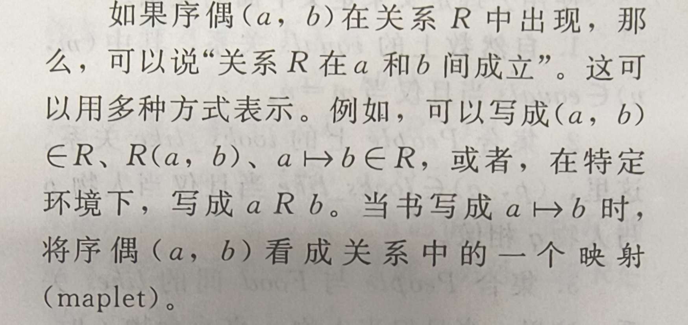
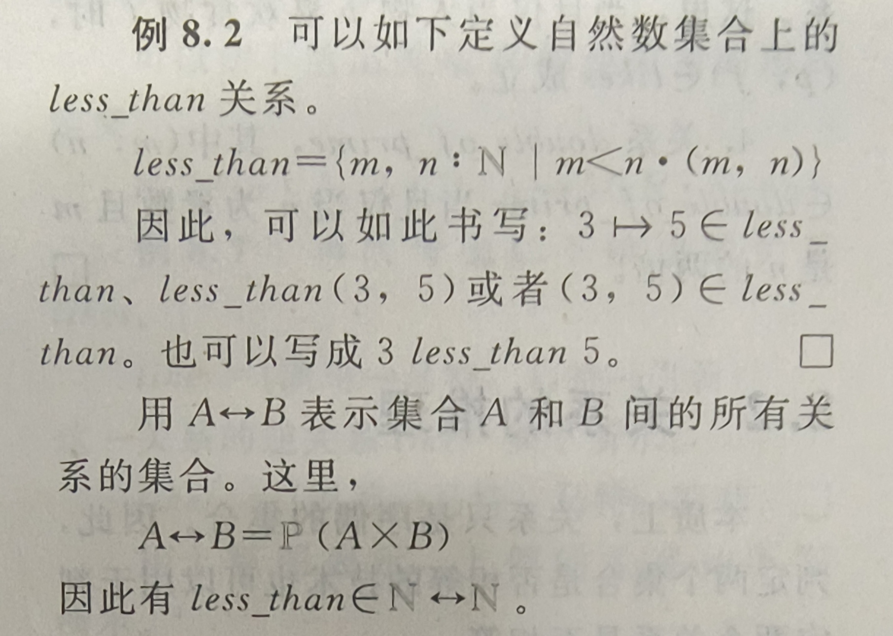
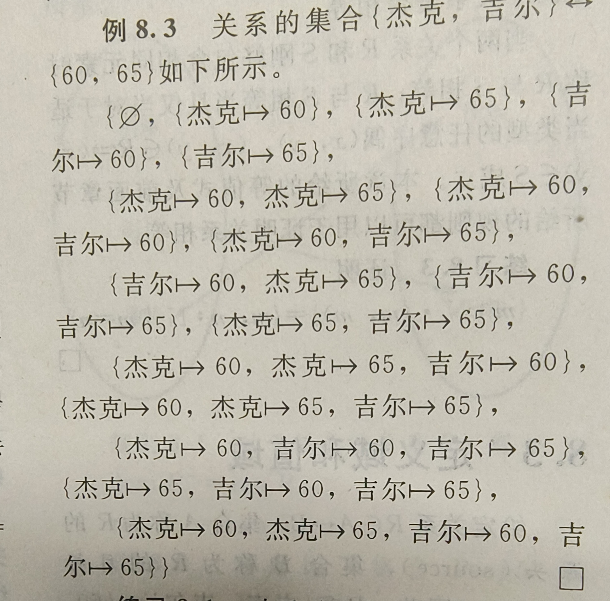
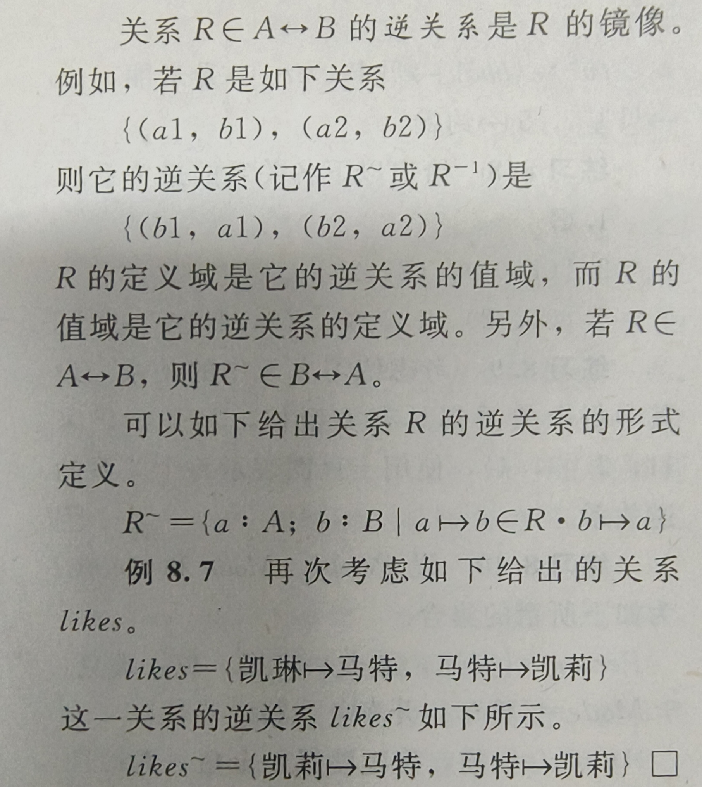

1. 二元关系
   1. 
   2. 
   3. 
2. 关系的推理
   1. 类似于真值表，只要你能证明所有的关系都是一样就行，就是说两个关系刚好包含相同元素
3. 定义域和值域
   1. 源头就是前面那个集合
   2. 目标就是后面那个集合
   3. 定义域就是源头，用dom(ain)表示
   4. 值域就是目标，用ran(ge)表示
4. 关系的逆
   1. 
   2. 关系的空集的逆关系为空集，注意要理解，什么是关系的空集
5. 关系上的运算
   1. 定义域限制有两种方式，都是关注定义域做操作
   2. 值域限制
   3. 关系的像
   4. 你把他想象成一种映射，就会非常好理解
6. 关系的合成
   1. 就是合成两个关系为一个关系
   2. 者必须要第一个关系的值域等同于第二个关系的定义域
7. 同类关系和异类关系
   1. 当关系的源头和目标是同一类型的，也就是说，数字映射到数字，这就是同类关系
   2. 同类关系可以自己跟自己合成
   3. 比如，平方跟自己合成，就变成了四次方
8. 关系的性质
   1. 自反性
      1. 使用关系的逆之后，不变
      2. 就是源头的元素和目标的元素不仅类型一致，而且完全相同
   2. 传递性
      1. 非形式的说，就是关系自己跟自己的时候是关系自己的元素
   3. 对称性
      1. 当且仅当，每个关系的逆都在这个集合内的时候
   4. 非对称性
      1. 完全非对称，每个关系的逆都找不到
   5. 反对称性
      1. 只要有源头变成目标，目标变成源头，就是两者相等
   6. 完全性
      1. 在集合中，任意选两个元素都是存在关系的
   7. 注意：这里面都是建立在同类关系的基础之上进行讨论的
9.  顺序与等价
   1.  偏序
       1.  自反，传递，反对称缺一不可
   2.  全序
       1.  反对称，传递，完全缺一不可
   3.  等价关系
       1.  对称，传递，自反
10. 闭包
    1.  自反闭包
    2.  传递闭包
    3.  自反传递闭包
    4.  对称闭包
11. n元关系